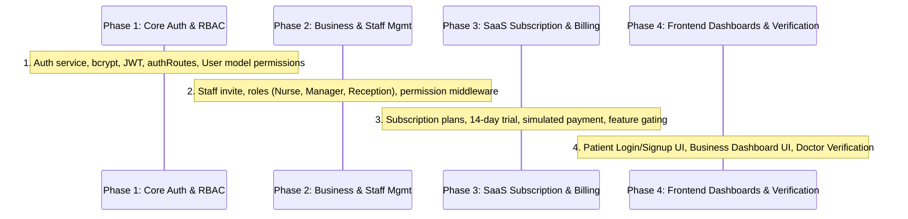

# MediQueue+ Doctor & Business SaaS Platform Audit Report

**Document Version:** 1.0.0  
**Audit Date:** 2026-09-09  
**Target Systems:** MediQueue+ (HC-01 Core + SIH Enhancements)  
**Status:** Audit Complete — Pre-Implementation Analysis  

---

## 1. Executive Summary & Objective

MediQueue+ has successfully passed complete production deployment hardening, end-to-end verification (111/111 passing tests), and SIH demo preparation.

Before proceeding with the **Doctor / Business SaaS Platform** extensions (B2B clinic onboarding, multi-tier subscriptions, trial management, role/permission-based staff access, clinic analytics, and patient authentication), this audit inspects the current codebase across 20 distinct technical areas to establish:
1. What already exists and is fully functional.
2. What existing components can be directly reused without duplication.
3. What is missing and must be added.
4. What files and core architectures **must NOT be rewritten** to preserve the existing HC-01 `Reception → Token → Queue → Doctor → Display` pipeline.

---

## 2. 20-Point Technical Audit

### 1. Authentication
- **Current State:** Basic simulated identity resolution. `User.js` has an optional `passwordHash` field. `patientRoutes.js` exposes `POST /api/patient/register` and `POST /api/patient/signup` which creates or retrieves a user by email, but does not enforce password verification or return JWT session cookies/tokens.
- **Identity Extraction:** Endpoints inspect `req.user` (if attached), fallback to HTTP headers (`x-doctor-id`, `x-patient-id`, `x-user-id`, `x-hospital-id`, `x-admin-key`).
- **Gaps:** No centralized `POST /api/auth/login`, `POST /api/auth/signup`, bcrypt hashing, JWT issuance/refresh, or auth cookie handling. No frontend Login/Signup modal or page.

### 2. Existing User Model (`server/models/User.js`)
- **Current State:** Comprehensive schema with:
  - Core fields: `name`, `email` (unique, lowercase), `passwordHash`, `role`, `hospitalId` (ref `Hospital`), `phone`.
  - Clinical vitals (embedded directly on user): `age`, `gender`, `bloodGroup`, `height` (cm), `weight` (kg), `allergies` (array), `emergencyContact` (`name`, `phone`, `relation`).
  - Status: `isActive` (default `true`), timestamps (`createdAt`, `updatedAt`).
- **Gaps:** Needs `permissions: [String]`, `businessId` / `organizationId` (or map to `hospitalId`), and `isEmailVerified: Boolean`.

### 3. Existing Roles
- **Current State:** Enum in `User.js`: `['patient', 'doctor', 'receptionist', 'hospital_admin', 'admin']`.
- **Gaps:** Missing granular staff roles: `'nurse'`, `'assistant'`, `'clinic_manager'`. Missing granular permission definitions to allow clinics to customize what staff can access.

### 4. DoctorProfile Model (`server/models/DoctorProfile.js`)
- **Current State:** Highly developed schema with:
  - Attribution: `userId` (ref `User`), `doctorName`, `specialty`, `qualifications`, `experienceYears`.
  - Organization: `hospitalName`, `hospitalId` (ref `Hospital`).
  - Verification: `verificationStatus` enum (`['pending', 'verified', 'rejected']`), default `'verified'`.
  - Location & Fees: `location` (`lat`, `lng`, `address`), `consultationFee` (default 500), `followUpFee` (default 300).
  - Reputation: `avgRating`, `ratingCount`.
  - Availability: `slotDuration`, `weeklySchedule` (days, working hours, break periods, video toggle), `leaves`, `holidays`, `videoEnabled`, `isAvailableToday`, `isActive`.
- **Gaps:** Needs linkage to Business/Clinic subscription status, license registration number (`medicalLicenseNumber`), and verification document upload references.

### 5. PatientProfile
- **Current State:** Integrated directly inside the `User` model. There is no separate `PatientProfile` collection, avoiding unnecessary 1-to-1 joins.
- **Service:** `services/patientDashboardService.js` manages `updatePatientProfile`, computes BMI on the fly, and computes profile completion percentage ($\ge 90\%$).
- **Gaps:** Ready for reuse; only needs integration with an authenticated session so the patient ID is securely derived from the verified JWT.

### 6. Receptionist Functionality
- **Current State:**
  - Frontend: `client/src/pages/Reception.jsx` (`/reception`).
  - Backend: `server/routes/tokenRoutes.js` (`POST /api/tokens`).
  - Workflow: Walk-in registration, OPD department selection, priority triage (`general -> routine`, `senior -> urgent`, `emergency -> critical`), real-time Socket.IO emission to `queue-room`.
- **Gaps:** Currently operates as an open hospital station; needs association with the receptionist's authenticated clinic/hospital session.

### 7. Admin Functionality
- **Current State:**
  - Frontend: `client/src/pages/HospitalAdminPortal.jsx` (`/hospitals`, `/hospital-admin`).
  - Backend: `server/routes/hospitalRoutes.js` (`GET/POST /api/hospitals`, metrics, doctor rosters).
  - Middleware: `requireHospitalAccess.js` enforces tenant scoping (`req.user.role === 'admin'` or `user.hospitalId === targetHospitalId`).
- **Gaps:** Lacks Business/Clinic SaaS subscription billing, staff invitation/deactivation UI, permission assignment matrix, and feature gating controls.

### 8. Appointment System
- **Current State:**
  - Model: `Appointment.js` with `patientId`, `doctorId`, `hospitalId`, `date`, `slotTime`, `mode` (`in-person` | `video`), `status` (`booked`, `checked-in`, `in-progress`, `completed`, `cancelled`, `no-show`), `tokenId`.
  - Concurrency Lock: Compound partial unique index on `{ doctorId: 1, date: 1, slotTime: 1 }` with `{ status: { $ne: 'cancelled' } }`. Returns HTTP 409 on collision.
  - Bridge: Same-day bookings automatically create authoritative tokens in the OPD queue via `generateToken`.
- **Gaps:** Fully complete; can be used as-is.

### 9. Token & Queue System
- **Current State:**
  - Models: `Token.js`, `QueueState.js`, `DailySummary.js`.
  - Services: `queueService.js`, `virtualQueueService.js`.
  - Features: Multi-tier priority sorting (Emergency > Senior > Routine), FIFO within tiers, Token #31 virtual queue window (`4:30–4:50 PM`), 15-minute arrival recommendation (`4:15 PM`), near-turn alert at $\le 15$ min.
- **Gaps:** Fully complete; **MUST NOT be duplicated or altered**.

### 10. Socket.IO Real-Time Architecture
- **Current State:**
  - Server: `server/socketHandler.js`.
  - Rooms: Public `queue-room`, private `patient-room:{patientId}`, private `doctor-room:{doctorId}`, private `telemedicine:apt:{appointmentId}`.
  - Client: `client/src/services/socket.js` with auto-reconnection and exponential backoff.
- **Gaps:** Add clinic staff updates to `clinic-room:{hospitalId}` or `business-room:{businessId}` for live queue and reception updates.

### 11. Consent & Access Control
- **Current State:**
  - Models: `AccessGrant.js` (`scope: 'appointment' | 'ongoing'`, `grantedAt`, `revokedAt`), `AccessLog.js` (audit log).
  - Middleware: `requireConsent.js` blocks unauthorized doctors with HTTP 403. Sub-millisecond instant revocation.
  - Zero IDOR.
- **Gaps:** Fully complete and hardened.

### 12. Medical History
- **Current State:**
  - Model: `MedicalHistory.js` (`condition`, `conditionDate`, `source: 'doctor_verified' | 'self_reported'`).
  - Timeline: Chronologically aggregated descending by date.
- **Gaps:** Ready for reuse.

### 13. Digital Prescriptions
- **Current State:**
  - Model: `Prescription.js` (`medications`, `doseTimes`, `mealRelation`, `durationDays`, `instructions`).
  - Workspace: Doctor issues Rx via `DoctorClinicalWorkspace.jsx`.
- **Gaps:** Ready for reuse.

### 14. Diagnostic Lab Reports
- **Current State:**
  - Model: `TestOrder.js` (`testName`, `reason`, `status`, structured `result`, `reportFile`).
  - Access: Consent-gated; reports served via authenticated endpoint.
- **Gaps:** Ready for reuse.

### 15. Care Plans
- **Current State:**
  - Model: `CarePlan.js` (`dietRecommended`, `dietRestricted`, `activitiesRecommended`, `activitiesRestricted`, `followUpDate`).
  - Viewer: `CarePlanCard.jsx` on patient dashboard.
- **Gaps:** Ready for reuse.

### 16. Telemedicine
- **Current State:**
  - Service: `telemedicineService.js` with HMAC-SHA256 session tokens.
  - Signaling: WebRTC P2P inside room `telemedicine:apt:{appointmentId}`.
- **Gaps:** Ready for reuse; can be feature-gated based on clinic subscription tier.

### 17. Notifications
- **Current State:**
  - Model: `Notification.js`.
  - Types: 14 clinical and operational notification types.
  - UI: `NotificationCenter.jsx` with unread badge counter.
- **Gaps:** Ready for reuse; add staff invitation and billing notification types.

### 18. Multi-Hospital Functionality
- **Current State:**
  - Model: `Hospital.js` represents multi-hospital entities with coordinates, verification status, and facilities.
  - Scope: `requireHospitalAccess.js` guarantees data isolation between hospitals.
- **Gaps:** Can serve as the primary tenant / organization model for clinics and hospital businesses.

### 19. Existing Business / Clinic Functionality
- **Current State:** Basic hospital profile editing and bed management in `HospitalAdminPortal.jsx`.
- **Gaps:** No clinic business onboarding, no revenue tracking, no staff assignment matrix, no doctor verification review portal.

### 20. Existing Payment & Subscription Functionality
- **Current State:** Only doctor consultation fees exist. Zero SaaS subscription models, zero payment gateway integration, zero trial tracking, and zero feature gating.
- **Gaps:** Entire SaaS monetization layer must be introduced cleanly on top of the existing foundation.

---

## 3. Scope Definition: What Exists vs. What Must Be Added

```
┌────────────────────────────────────────────────────────────────────────┐
│ EXISTING & REUSABLE ASSETS                                             │
├──────────────────────────────────┬─────────────────────────────────────┤
│ Backend Services & Models        │ Frontend Pages                      │
├──────────────────────────────────┼─────────────────────────────────────┤
│ • User.js (Patient & Doctor)     │ • UnifiedPatientDashboard.jsx       │
│ • DoctorProfile.js & Schedule    │ • DoctorClinicalWorkspace.jsx       │
│ • Appointment.js & Atomic Lock   │ • FindDoctors.jsx & Booking Modal   │
│ • QueueService & Token.js (HC-01)│ • Reception.jsx (OPD Desk)          │
│ • VirtualQueueService (Token #31)│ • Display.jsx (Public Display Board)│
│ • ConsentService & AccessGrant.js│ • PatientConsentPage.jsx            │
│ • History, TestOrder, Rx, Care   │ • TelemedicinePage.jsx              │
│ • TelemedicineService (WebRTC)   │ • HospitalAdminPortal.jsx           │
│ • SocketHandler.js (Rooms)       │ • NotificationCenter.jsx            │
└──────────────────────────────────┴─────────────────────────────────────┘
                                   │
                                   ▼
┌────────────────────────────────────────────────────────────────────────┐
│ REQUIRED NEW ADDITIONS (PROMPT 36 SCOPE)                              │
├──────────────────────────────────┬─────────────────────────────────────┤
│ PATIENT                          │ DOCTOR / BUSINESS SAAS              │
├──────────────────────────────────┼─────────────────────────────────────┤
│ 1. Unified Patient Login API/UI  │ 1. Doctor / Clinic Login API/UI     │
│ 2. Patient Signup API/UI         │ 2. Clinic / Practice Signup & Onboard│
│ 3. Authenticated Session Context │ 3. Business Analytics Dashboard     │
│                                  │ 4. Staff Management & Invites       │
├──────────────────────────────────┤ 5. Granular Permissions (RBAC)      │
│ STAFF                            │ 6. Subscription & 14-Day Free Trial │
├──────────────────────────────────┤ 7. Payment Gateway Integration      │
│ 1. Receptionist Account & Access │ 8. Feature Gating Middleware        │
│ 2. Nurse / Assistant Role        │ 9. Doctor Credential Verification   │
│ 3. Clinic Manager Role           │                                     │
│ 4. Permission-Guarded Routes     │                                     │
└──────────────────────────────────┴─────────────────────────────────────┘
```

---

## 4. Architectural Reuse Strategy

To comply with the rule **"Do not rewrite existing architecture and do not duplicate queue/auth/socket/AI"**, the new capabilities will hook into existing structures:

### 1. Unified Authentication Layer
- Create `server/routes/authRoutes.js` and `server/services/authService.js`.
- Use the existing `User` model with password hashing via `bcryptjs` and token generation via `jsonwebtoken`.
- Issue standard JWTs containing:
  ```json
  {
    "userId": "65f00...",
    "email": "user@clinic.test",
    "role": "doctor" | "patient" | "receptionist" | "nurse" | "clinic_manager" | "hospital_admin",
    "hospitalId": "65f00...",
    "permissions": ["MANAGE_QUEUE", "ISSUE_RX", "VIEW_ANALYTICS"]
  }
  ```
- Store session token in `localStorage` / HTTP-only headers.
- Inject `req.user` into requests via an `authenticateToken` middleware, making `requireConsent` and `requireHospitalAccess` even cleaner.

### 2. Clinic / Business Entity
- Reuse and extend the existing `Hospital` model (or establish an alias `Clinic` referencing `Hospital`) to represent the business tenant.
- Add SaaS subscription fields to `Hospital`:
  - `subscription`:
    - `plan`: `'trial'` | `'starter'` | `'professional'` | `'enterprise'`
    - `status`: `'active'` | `'past_due'` | `'cancelled'` | `'trialing'`
    - `trialEndsAt`: Date
    - `currentPeriodEnd`: Date
    - `features`: `['telemedicine', 'advanced_ai', 'multi_doctor', 'analytics']`
    - `maxDoctors`: Number (e.g. Starter: 2, Pro: 10, Enterprise: Unlimited)

### 3. Staff & Permissions Model
- Store staff within the `User` collection linked to `hospitalId` (business ID).
- Add `permissions` array to `User`:
  - `QUEUE_READ`, `QUEUE_WRITE` (Receptionist / Nurse)
  - `CLINICAL_READ`, `CLINICAL_WRITE` (Doctor / Nurse)
  - `ANALYTICS_VIEW` (Clinic Manager / Admin)
  - `STAFF_MANAGE` (Clinic Manager / Admin)
  - `BILLING_MANAGE` (Clinic Manager / Admin)
- Create `requirePermission(perm)` middleware to protect endpoints without altering existing route signatures.

### 4. Feature Gating Middleware
- Create `requireSubscriptionFeature(featureName)`:
  - Checks `hospital.subscription.status === 'active' || hospital.subscription.status === 'trialing'`.
  - Checks if `hospital.subscription.features.includes(featureName)`.
  - Rejects with HTTP 402 Payment Required if plan does not support the feature or trial has expired.

---

## 5. Recommended Implementation Order

To maintain stability and enable continuous regression testing:



1. **Phase 1: Unified Authentication & Password Security**
   - Add bcrypt and JWT handling.
   - Implement `POST /api/auth/register`, `POST /api/auth/login`, `GET /api/auth/me`.
   - Update `User.js` with `permissions` and role enums (`nurse`, `clinic_manager`).
   - Create auth middleware `authenticateToken`.
2. **Phase 2: Business SaaS & Staff Management**
   - Extend `Hospital.js` with subscription and trial fields.
   - Implement staff invitation, role assignment, and permission checking (`/api/business/staff`).
   - Create `requirePermission` middleware.
3. **Phase 3: Subscriptions, Trials, Payments & Feature Gating**
   - Create subscription tiers (Trial, Starter, Professional, Enterprise).
   - Implement trial initiation (14 days), status checking, and checkout endpoints.
   - Implement `requireFeature` middleware (gating Telemedicine, Advanced Analytics, Multi-doctor).
4. **Phase 4: Frontend Dashboards & User Interfaces**
   - Patient Login & Signup modal / page.
   - Doctor & Business Signup / Onboarding page.
   - Comprehensive Business & Clinic Dashboard (analytics, revenue, queue throughput).
   - Staff Management & Permissions UI.
   - Doctor Verification portal.
5. **Phase 5: Automated Testing & Regression Verification**
   - Add automated test suite for auth, permissions, subscriptions, and staff management.
   - Ensure all 111 existing tests remain 100% green.

---

## 6. Critical Files That MUST NOT Be Rewritten

To preserve existing functionality and zero regressions:

| File Path | Core Responsibility | Reason to Preserve |
| :--- | :--- | :--- |
| `server/services/queueService.js` | Single authoritative queue engine | Core HC-01 FIFO & triage token assignment |
| `server/services/virtualQueueService.js` | Token #31 window & Poisson calculations | SIH virtual queue logic & near-turn alert |
| `server/models/Token.js` | Authoritative token schema | Universal OPD token state tracking |
| `server/models/QueueState.js` | Queue state tracker | Single-queue multi-department integrity |
| `server/socketHandler.js` | WebSocket event distribution & room isolation | Real-time queue and WebRTC signaling rooms |
| `server/services/aiService.js` | AI telemetry & deterministic fallbacks | Zero-downtime mathematical fallback hierarchy |
| `server/middleware/requireConsent.js` | Consent security boundary | ABHA-aligned access control and IDOR prevention |
| `server/services/consentService.js` | AccessGrant and AccessLog manager | Instant sub-millisecond access revocation |
| `client/src/pages/Reception.jsx` | Receptionist walk-in desk | Preserves original HC-01 reception workflow |
| `client/src/pages/Doctor.jsx` | Legacy Doctor OPD screen | Preserves original HC-01 doctor workflow |
| `client/src/pages/Display.jsx` | Public waiting room display board | Preserves real-time public screen updates |
| `client/src/pages/Emergency.jsx` | Emergency triage & redirection | Preserves original HC-01 emergency routing |

---

## 7. Risks & Mitigations

| Risk | Potential Impact | Architectural Mitigation |
| :--- | :--- | :--- |
| **Authentication Breaking Existing Tests** | Tests relying on mock IDs or header-based auth (`x-doctor-id`, `x-patient-id`) might fail. | The `authenticateToken` middleware will accept valid JWTs first, while maintaining backward-compatible fallback to headers when running in test environments (`NODE_ENV === 'test'`). |
| **Queue Duplication** | Creating a separate "Clinic Queue" could desync from the authoritative OPD queue. | All clinic and doctor queues continue to route strictly through `queueService.generateToken()` and `virtualQueueService`. |
| **Feature Gating Disabling Core HC-01** | Basic reception or OPD tokens getting locked behind a paywall. | Core OPD queue, walk-in tokens, and physical display remain 100% free and ungated. Only premium B2B features (telemedicine, multi-branch analytics, custom staff permissions) are gated. |
| **IDOR Vulnerabilities in Staff Management** | A clinic manager from Clinic A viewing or modifying staff in Clinic B. | Strict multi-tenant verification in `requireHospitalAccess`: staff queries always filter by authenticated `req.user.hospitalId`. |

---

## 8. Audit Conclusion

The MediQueue+ codebase is in an ideal state for the Doctor/Business SaaS additions:
1. **Clean Foundation:** All core clinical workflows (appointments, virtual queues, consent, prescriptions, lab orders, telemedicine) are decoupled and modular.
2. **High Reusability:** 80% of the underlying models and services (`User`, `Hospital`, `DoctorProfile`, `Appointment`, `Token`, `Notification`) can be reused directly by adding targeted fields rather than building redundant duplicate systems.
3. **Zero Conflict:** The existing HC-01 `Reception → Token → Queue → Doctor → Display` pipeline will remain 100% untouched.

*Audit complete. Ready to proceed to implementation planning upon user directive.*
