# IMPLEMENTATION ARCHITECTURE — MediQueue+
**Date:** 2026-09-09 | **Base:** HC-01 Hospital Queue Management System
**Principle:** Every new module wraps around the existing HC-01 core. Nothing is replaced.

---

## 1. System Architecture

```mermaid
graph TB
    subgraph BROWSER["Browser Clients"]
        KP["Kiosk Panels (unchanged)\nReception / Doctor / Display / Emergency"]
        PP["Patient Dashboard (new)\n/login /signup /patient-dashboard\n/find-doctors /video/:id"]
        DP["Doctor Dashboard (new)\n/doctor-dashboard\n/doctor-dashboard/profile"]
    end

    subgraph CLIENT["client/ — React 18 + Vite + Tailwind"]
        ROUTER["React Router v6\nApp.jsx (extended)"]
        AUTH_CTX["AuthContext (new)\nuseAuth hook, JWT storage"]
        SOCK_CTX["SocketContext (existing)\nExtended: joins patient-room:{id}"]
        Q_CTX["QueueContext / Zustand (existing)\nExtended: patientQueue state"]
        API_SVC["api.js (existing)\nExtended: new endpoint functions"]
        SOCK_SVC["socket.js (existing)\nUnchanged"]
    end

    subgraph SERVER["server/ — Node.js + Express + Socket.IO"]
        subgraph EXISTING_ROUTES["Existing Routes (DO NOT TOUCH)"]
            TR["tokenRoutes.js\n/api/tokens"]
            DR["doctorRoutes.js\n/api/doctor"]
            ER["emergencyRoutes.js\n/api/emergency"]
            SR["summaryRoutes.js\n/api/summary"]
        end

        subgraph NEW_ROUTES["New Routes"]
            AR["authRoutes.js\n/api/auth"]
            PR["patientRoutes.js\n/api/patients"]
            DPR["doctorProfileRoutes.js\n/api/doctors"]
            APR["appointmentRoutes.js\n/api/appointments"]
            PRER["prescriptionRoutes.js\n/api/prescriptions"]
            RR["reminderRoutes.js\n/api/reminders"]
            RAT["ratingRoutes.js\n/api/ratings"]
            TOR["testOrderRoutes.js\n/api/test-orders"]
            CPR["carePlanRoutes.js\n/api/care-plans"]
            ACR["accessRoutes.js\n/api/access"]
            VR["videoRoutes.js\n/api/video"]
        end

        subgraph EXISTING_SVC["Existing Services (DO NOT TOUCH)"]
            QS["queueService.js\ngenerateToken / callNext\ncompleteToken / emitQueueUpdate"]
            AS["aiService.js\nhaversineDistance\nfindNearbyHospitals"]
            SS["summaryService.js"]
        end

        subgraph NEW_SVC["New Services"]
            HS["historyService.js\ncreateDoctorVerifiedEntry"]
            RS["reminderService.js\ngenerateReminders"]
            NTS["notificationService.js\nsend / mock"]
        end

        subgraph MIDDLEWARE["Middleware"]
            EH["errorHandler.js (existing)"]
            RL["rateLimiter.js (existing)"]
            VAL["validate.js (existing)"]
            AUTH_MW["auth.js (new)\nrequireAuth / requireRole"]
            CA["checkAccess.js (new)\nconsent + audit log"]
        end

        SH["socketHandler.js (extended)\n+patient-room:{patientId}\n+queue:position-update\n+queue:near-turn\n+reminder:due\n+video:* signaling"]

        CRON["node-cron scheduler (new)\nReminderSchedule poller"]
    end

    subgraph DB["MongoDB 7"]
        subgraph EXISTING_MODELS["Existing Collections (DO NOT TOUCH)"]
            TK["tokens"]
            DS["doctorsessions"]
            QST["queuestates"]
            EC["emergencycases"]
            DSUM["dailysummaries"]
        end
        subgraph NEW_MODELS["New Collections"]
            US["users"]
            PAT["patientprofiles"]
            DPRO["doctorprofiles"]
            MH["medicalhistoryentries"]
            AP["appointments"]
            PRE["prescriptions"]
            RSCHED["reminderschedules"]
            RAT_M["ratings"]
            TO["testorders"]
            CP["careplans"]
            AG["accessgrants"]
            AL["accesslogs"]
        end
    end

    subgraph AI["ai/ — FastAPI + Uvicorn"]
        subgraph EXISTING_AI["Existing Endpoints"]
            PRED["/predict (Poisson)"]
            UPD["/update-data"]
            EMRD["/emergency/redirect"]
            HN["/hospitals/nearby"]
        end
        subgraph NEW_AI["New Endpoints"]
            RD["/rank-doctors\ncomposite score"]
            PS["/priority-score\nanti-starvation reorder"]
            WE["/wait-estimate/patient/{tokenId}\nper-patient ETA"]
        end
        HAVE["haversine() utility\nshared by old + new"]
    end

    KP & PP & DP --> ROUTER
    ROUTER --> AUTH_CTX & SOCK_CTX & Q_CTX
    AUTH_CTX & Q_CTX --> API_SVC
    SOCK_CTX --> SOCK_SVC

    API_SVC -->|HTTP| EXISTING_ROUTES
    API_SVC -->|HTTP| NEW_ROUTES

    SOCK_SVC -->|WebSocket| SH

    EXISTING_ROUTES --> EXISTING_SVC
    NEW_ROUTES --> NEW_SVC
    NEW_ROUTES --> EXISTING_SVC
    NEW_ROUTES --> MIDDLEWARE
    APR -->|calls generateToken| QS

    EXISTING_SVC --> DB
    NEW_SVC --> DB
    NEW_ROUTES --> DB

    QS -->|HTTP fire-forget| AS
    AS -->|/update-data| UPD
    APR -->|/priority-score| PS
    APR -->|/wait-estimate| WE
    DPR -->|/rank-doctors| RD

    SH --> DB
    CRON --> DB
    CRON --> SH
```

---

## 2. Frontend Architecture

### 2.1 Route Map (Extended App.jsx)

```
/                        → redirect to /home
/home                    → Home.jsx (existing, unchanged)
/reception               → Reception.jsx (existing, unchanged)
/doctor                  → Doctor.jsx (existing, unchanged, extended with priority badge)
/display                 → Display.jsx (existing, unchanged)
/emergency               → Emergency.jsx (existing, unchanged)

── NEW ROUTES ──────────────────────────────────────────────────────
/login                   → Login.jsx             (public)
/signup                  → Signup.jsx            (public)

/patient-dashboard       → PatientDashboard.jsx  (role=patient guard)
  /patient-dashboard/profile        → PatientProfile.jsx
  /patient-dashboard/history        → MedicalHistory.jsx
  /patient-dashboard/appointments   → PatientAppointments.jsx
  /patient-dashboard/tests          → TestOrders.jsx
  /patient-dashboard/care-plans     → CarePlans.jsx

/find-doctors            → FindDoctors.jsx        (role=patient guard)
/doctors/:id             → DoctorDetail.jsx       (role=patient guard)

/doctor-dashboard        → DoctorDashboard.jsx   (role=doctor guard)
  /doctor-dashboard/profile         → DoctorProfileSetup.jsx
  /doctor-dashboard/appointments    → DoctorAppointments.jsx

/video/:appointmentId    → VideoConsult.jsx       (patient or doctor guard)
```

### 2.2 Client State Architecture

```
┌─── AuthContext (NEW) ───────────────────────────────────────────┐
│  state: { user, token, isAuthenticated, loading }               │
│  actions: login(), logout(), fetchMe()                          │
│  storage: localStorage (JWT) or httpOnly cookie                 │
│  axios interceptor: attaches Authorization: Bearer {token}      │
│  to api.js on every request                                     │
└─────────────────────────────────────────────────────────────────┘

┌─── SocketContext (EXISTING — EXTEND) ──────────────────────────┐
│  Existing: auto-joins room by URL path                          │
│  NEW: if role=patient, also emit join_room('patient-room:{id}') │
│  Room stays active for the session lifetime                     │
└─────────────────────────────────────────────────────────────────┘

┌─── QueueContext / Zustand (EXISTING — EXTEND) ─────────────────┐
│  Existing state: queue[], currentToken, stats, loading          │
│  NEW state: patientQueueStatus {position, estimatedTime, near}  │
│  NEW actions: fetchQueuePosition(appointmentId)                 │
│  NEW socket listeners: queue:position-update, queue:near-turn   │
└─────────────────────────────────────────────────────────────────┘

┌─── api.js (EXISTING — EXTEND) ─────────────────────────────────┐
│  All new endpoint functions appended to existing file           │
│  Auth interceptor injected from AuthContext initialization      │
│  Existing: createToken, getQueue, callNextPatient, etc.         │
│  NEW: signup, login, getProfile, updateProfile,                 │
│       getDoctors, getDoctor, createAppointment, etc.            │
└─────────────────────────────────────────────────────────────────┘
```

### 2.3 Patient Workflow Diagram

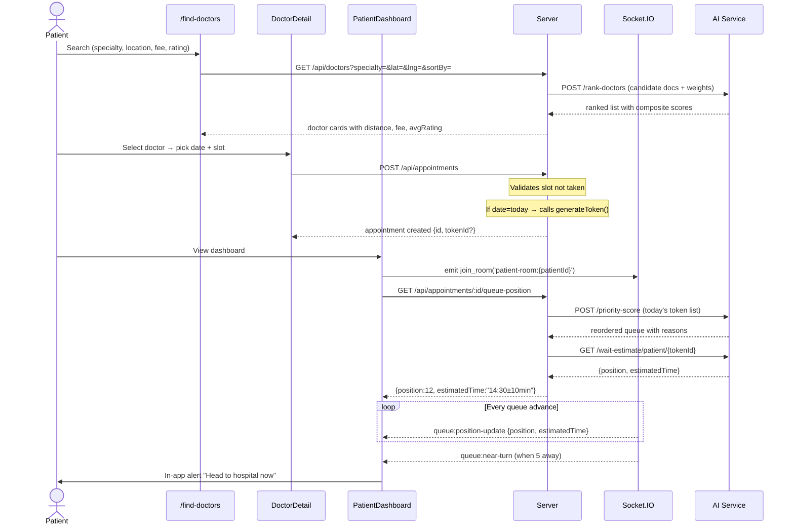

### 2.4 Doctor Workflow Diagram

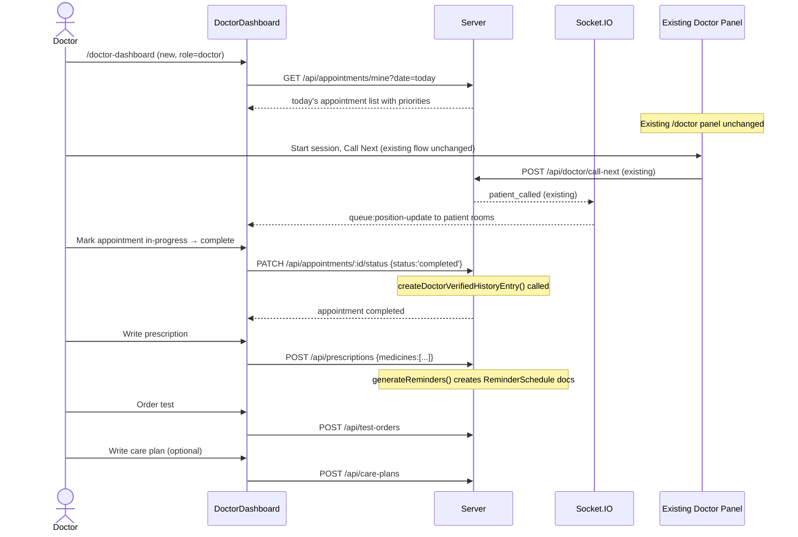

---

## 3. Backend Architecture

### 3.1 Server Entry Point Strategy

**Decision:** Use `server.js` (JavaScript) as the single canonical entry point.

- `server.ts` is to be **deleted** (or kept frozen and ignored) to avoid ambiguity.
- All new routes registered in `server.js` beneath existing registrations.
- Pattern:
  ```
  // ── Existing Routes (DO NOT MODIFY ORDER) ──
  app.use('/api/tokens', tokenRoutes);
  app.use('/api/doctor', doctorRoutes);
  app.use('/api/summary', summaryRoutes);
  app.use('/api/emergency', emergencyRoutes);

  // ── New MediQueue+ Routes ──
  app.use('/api/auth', authRoutes);
  app.use('/api/patients', patientRoutes);
  app.use('/api/doctors', doctorProfileRoutes);
  app.use('/api/appointments', appointmentRoutes);
  app.use('/api/prescriptions', prescriptionRoutes);
  app.use('/api/reminders', reminderRoutes);
  app.use('/api/ratings', ratingRoutes);
  app.use('/api/test-orders', testOrderRoutes);
  app.use('/api/care-plans', carePlanRoutes);
  app.use('/api/access', accessRoutes);
  app.use('/api/video', videoRoutes);
  ```
- `node-cron` scheduler initialized in `server.js` after DB connects (not in a route file).

### 3.2 New Service Layer

```
server/services/
├── queueService.js       (EXISTING — untouched)
├── aiService.js          (EXISTING — extended: add rankDoctors(), getPriorityScore())
├── summaryService.js     (EXISTING — untouched)
├── historyService.js     (NEW)  — createDoctorVerifiedHistoryEntry()
└── reminderService.js    (NEW)  — generateReminders(prescription)
                                 — schedulePoller() (sets up node-cron job)
```

**`historyService.js` interface:**
```js
export async function createDoctorVerifiedHistoryEntry(
  patientId, doctorId, appointmentId, condition, notes
) → MedicalHistoryEntry
```

**`reminderService.js` interface:**
```js
export async function generateReminders(prescription) → ReminderSchedule[]
export function startReminderPoller(io) // called once from server.js after DB connect
```

### 3.3 Appointment → Token Integration (Critical Path)

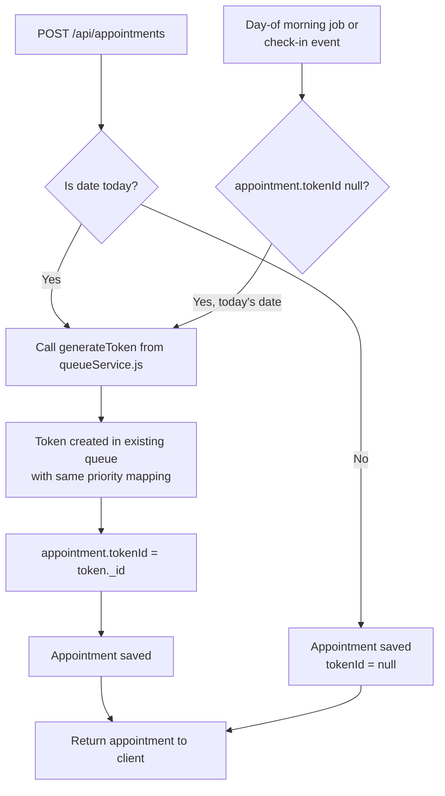

**Priority Mapping (Appointment → Token):**
```
Appointment.priority    Token.priority
─────────────────────────────────────
'critical'          →  'emergency'
'urgent'            →  'senior'
'routine'           →  'general'
```

This mapping is a single utility function in `appointmentRoutes.js`, not in `queueService.js`.

---

## 4. Database Architecture

### 4.1 Collection Map

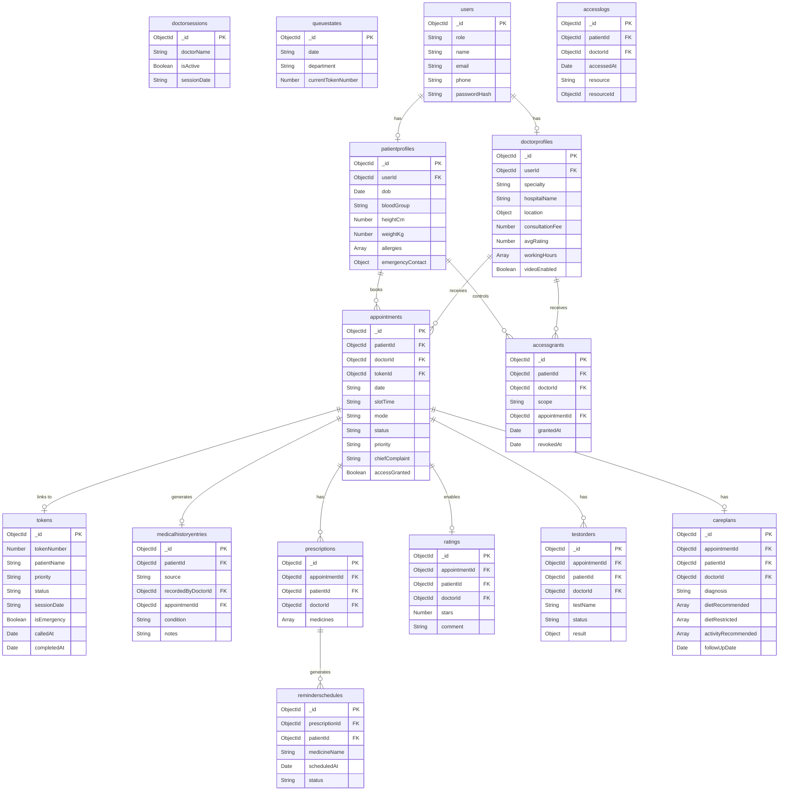

### 4.2 Key Indexes (New Models)

| Model | Index | Type | Reason |
|---|---|---|---|
| users | email | unique | Login lookup |
| patientprofiles | userId | unique | One profile per user |
| doctorprofiles | userId | unique | One profile per user |
| doctorprofiles | specialty + avgRating | compound | Search + sort |
| doctorprofiles | location | 2dsphere | Geospatial queries (or Haversine JS) |
| appointments | patientId + date | compound | Patient's appointments by date |
| appointments | doctorId + date + slotTime | unique | Prevent double-booking |
| appointments | tokenId | sparse | Look up appointment from token |
| reminderschedules | patientId + scheduledAt + status | compound | Poller query |
| accessgrants | patientId + doctorId + revokedAt | compound | Access check |
| accesslogs | patientId + accessedAt | compound | Patient audit log view |

---

## 5. Authentication Architecture

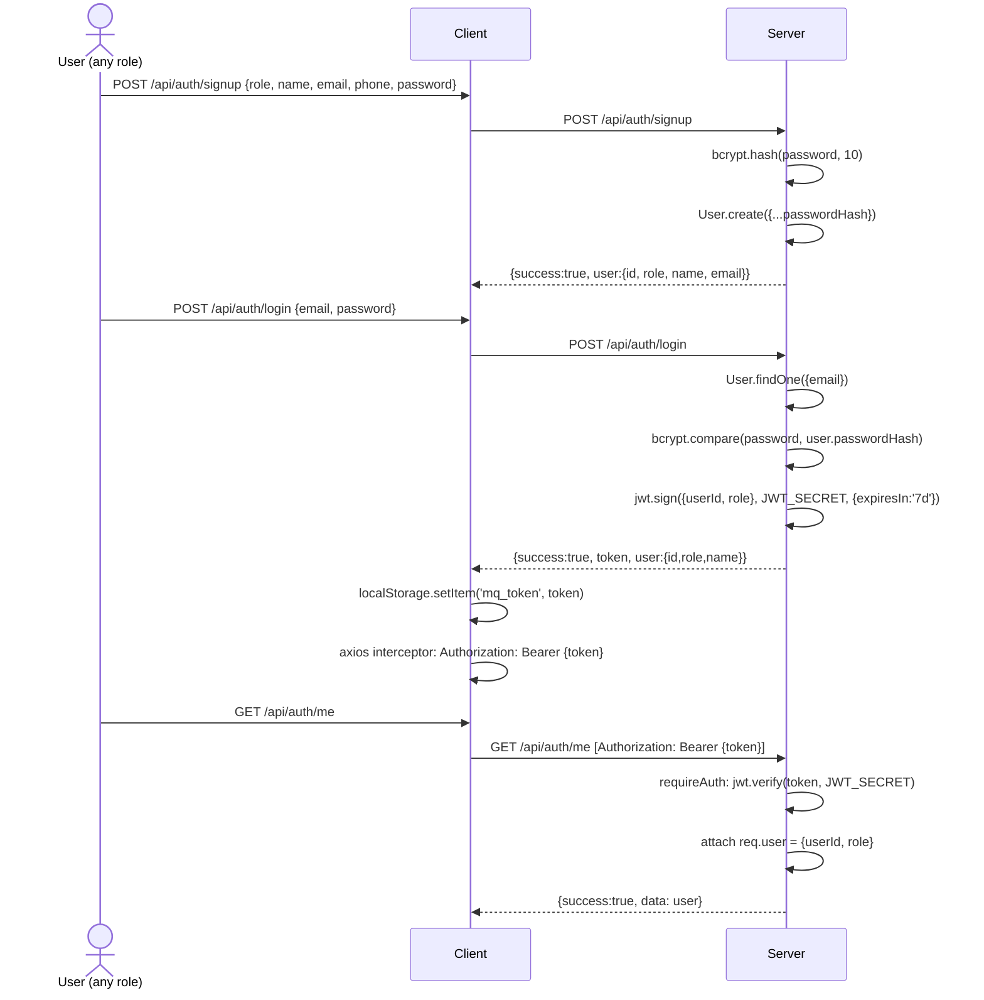

**Middleware chain for protected routes:**
```
requireAuth → validates JWT, attaches req.user
requireRole(['doctor']) → checks req.user.role
```

**Existing routes stay completely unguarded.** No auth on:
- `/api/tokens/*`
- `/api/doctor/*`
- `/api/summary/*`
- `/api/emergency/*`

---

## 6. Authorization Architecture

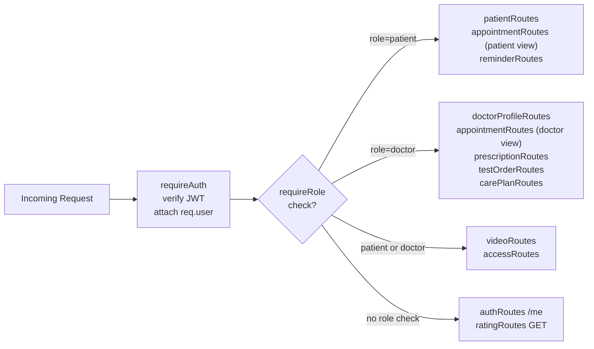

---

## 7. Consent & Access Control Architecture

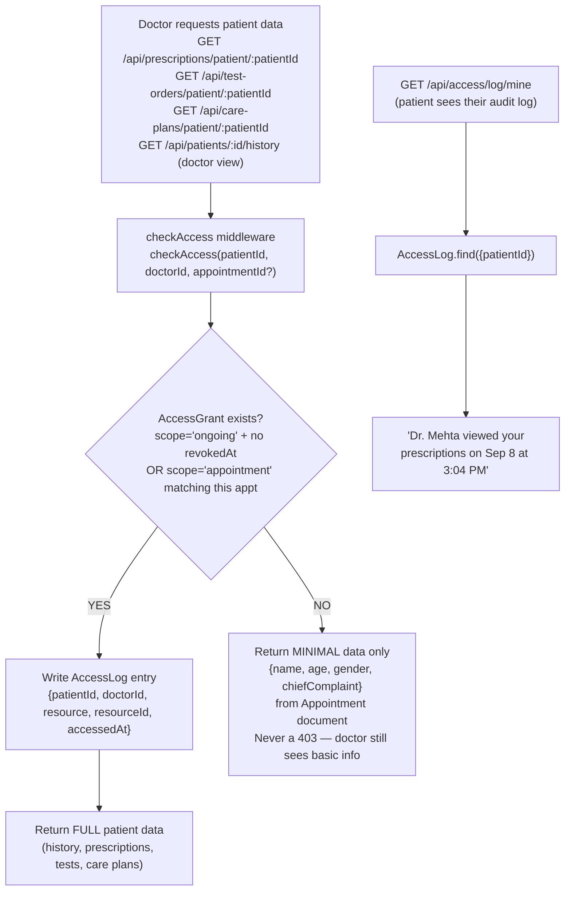

**Grant model:**
```
Patient grants access:
  scope='appointment' → valid only for one specific appointment
  scope='ongoing'     → valid until patient revokes
  revokedAt=null      → active grant
  revokedAt=Date      → revoked
```

---

## 8. Queue Integration Architecture

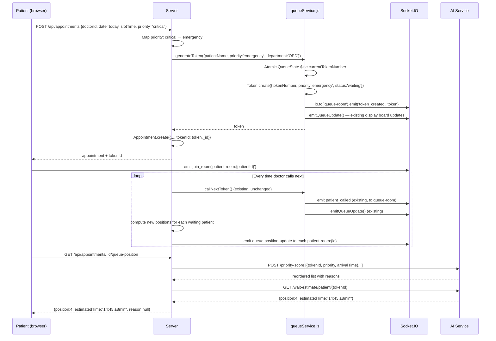

---

## 9. Recommendation Architecture

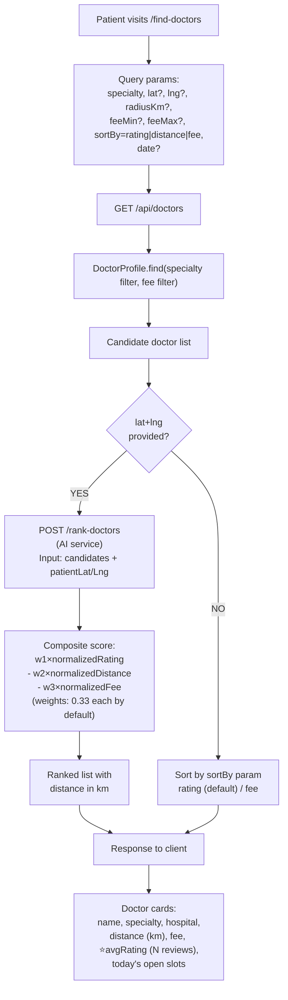

**AI `/rank-doctors` input/output contract:**
```json
Input:  { "patient_lat": 28.61, "patient_lng": 77.20,
          "doctors": [{ "id", "avg_rating", "fee", "lat", "lng" }],
          "weights": { "rating": 0.33, "distance": 0.33, "fee": 0.33 } }
Output: [{ "id", "score", "distance_km" }]  // sorted desc by score
```

---

## 10. Notification Architecture

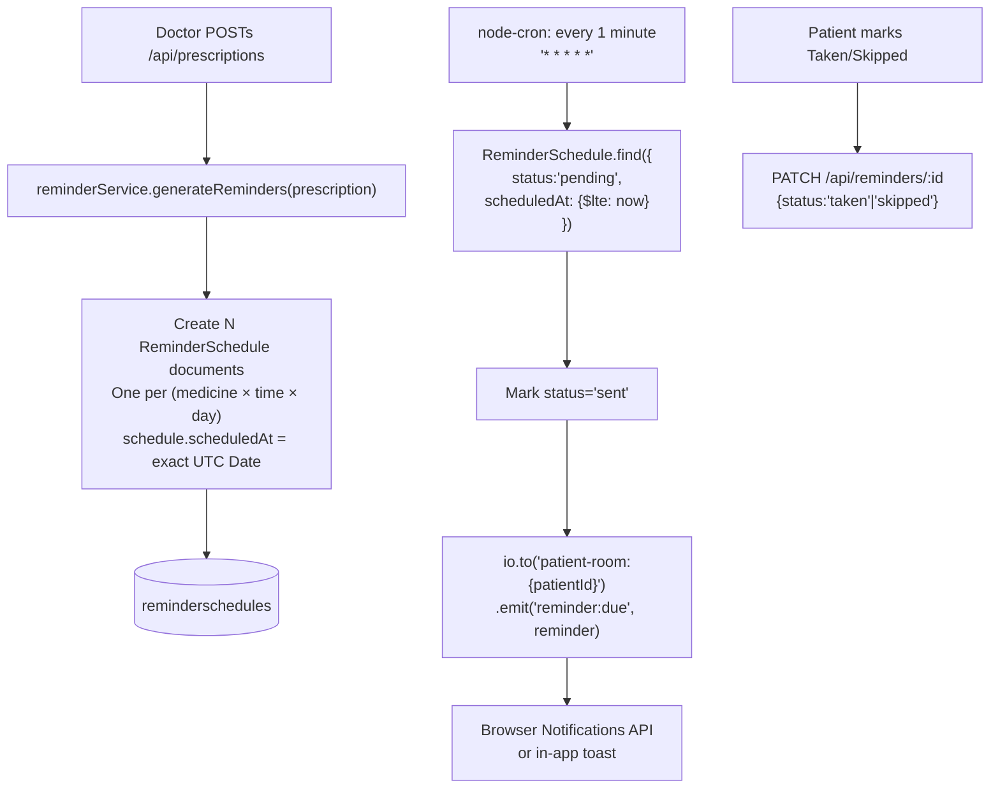

**near-turn notification (queue):**
```
In emitQueueUpdate() extension:
  For each waiting token with a linked appointmentId:
    compute new position
    emit queue:position-update to patient-room:{patientId}
    if position <= NEAR_TURN_THRESHOLD (default 5) AND not yet notified:
      emit queue:near-turn once (use Redis or in-process Set to track)
```

---

## 11. Telemedicine Architecture

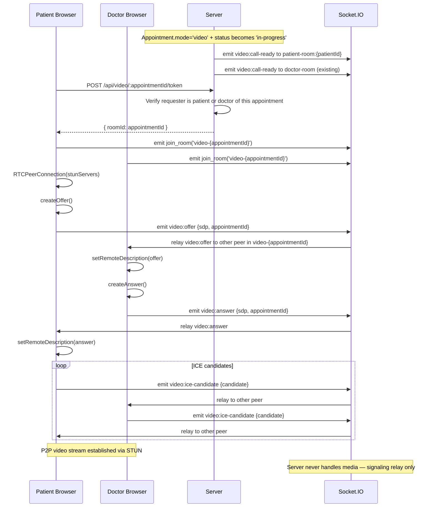

**STUN server:** `stun:stun.l.google.com:19302` (free, no infra needed)
**Signaling:** Existing Socket.IO server extended with `video-{appointmentId}` rooms.
**Media:** P2P via WebRTC — server handles zero media traffic.

---

## 12. AI Architecture Extension

### 12.1 New Endpoints Required

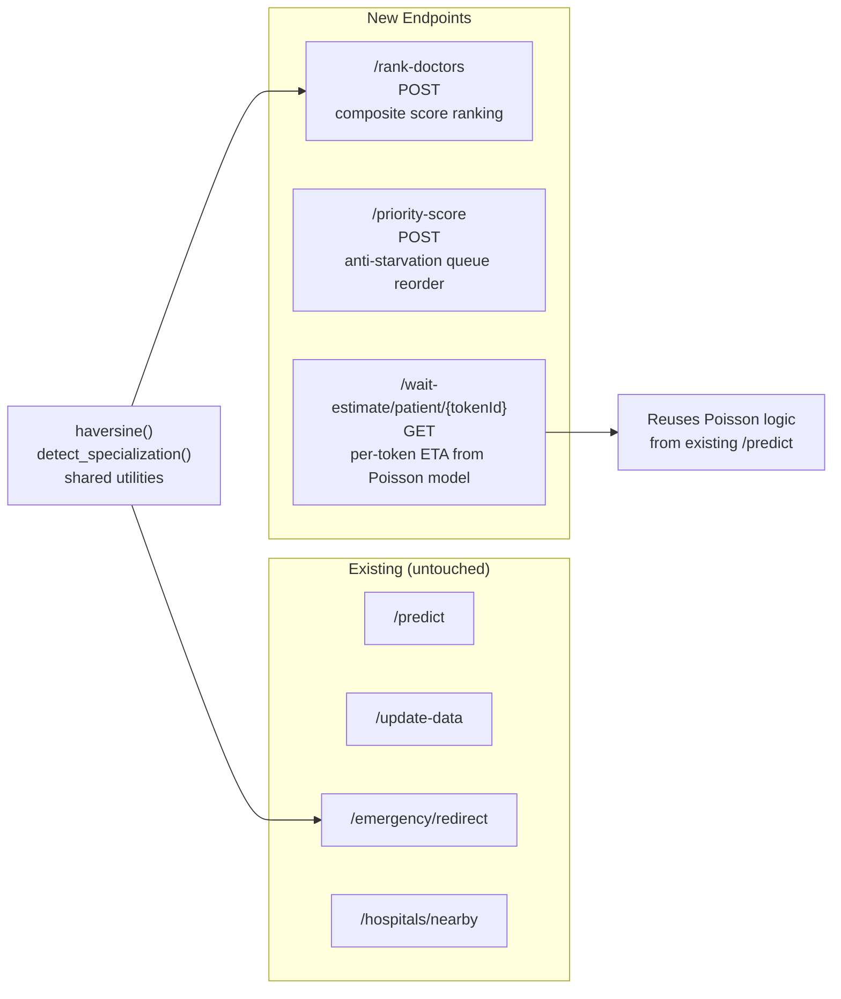

### 12.2 `/priority-score` Algorithm

```
Input: [{ token_id, priority, arrival_time }]

Priority weights:
  critical → weight 3
  urgent   → weight 2
  routine  → weight 1

Anti-starvation rule:
  No more than 2 consecutive routine patients skipped for a critical/urgent patient.
  Track skip_count per routine patient; if skip_count >= 2, insert them next.

Output: [{ token_id, effective_position, reason }]
  reason examples: null (no change), "moved up: Critical priority",
                   "held: max skips reached for routine patient"
```

### 12.3 `/rank-doctors` Algorithm

```
score = w1 × normalize(avgRating, 0, 5)
      - w2 × normalize(distance_km, 0, maxRadius)
      - w3 × normalize(fee, feeMin, feeMax)

Default weights: w1=w2=w3=0.33 (equal weighting)
Configurable per request.
Output: ranked list sorted by score DESC.
```

---

## 13. Pre-Migration Fixes (Must Do First)

Before any new feature is written, these fixes must be applied:

```
FIX-1: client/vite.config.js
  Change proxy target from Render URL to http://localhost:5000

FIX-2: server/server.js
  Keep server.js as canonical entry.
  Delete server.ts (or rename to server.ts.bak).

FIX-3: server/models/QueueState.js
  Add `waitingCount: { type: Number, default: 0 }` to schema.

FIX-4: server/.env.example
  Add: CORS_ORIGIN=http://localhost:5173
  Add: JWT_SECRET=changeme_in_production

FIX-5: server/package.json
  Add dependencies: bcrypt, jsonwebtoken, node-cron
```

---

## 14. Technology Additions

| Package | Type | Where | Purpose |
|---|---|---|---|
| `bcrypt` | npm dependency | server | Password hashing for auth |
| `jsonwebtoken` | npm dependency | server | JWT issuance + verification |
| `node-cron` | npm dependency | server | Reminder scheduler (every 1 min) |
| No new npm packages | — | client | All UI libraries already installed |
| No new Python packages | — | ai | FastAPI + Pydantic already sufficient |
| No new Docker services | — | infra | All new code fits in existing containers |
