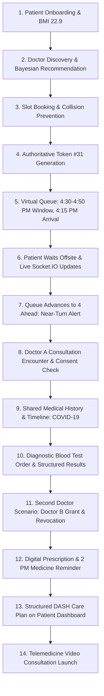
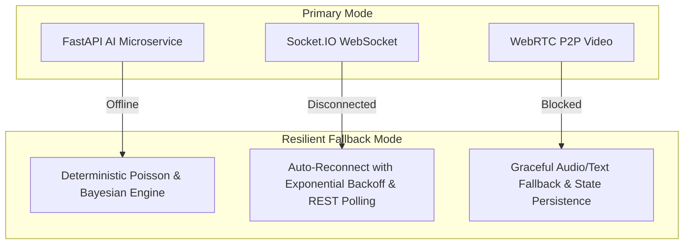

# MediQueue+ Smart India Hackathon (SIH) Final Demonstration Playbook

**System Name:** MediQueue+ Smart Hospital OPD Queue Management & Telemedicine Platform  
**Target Event:** Smart India Hackathon Grand Finale  
**Documentation Version:** 2.0.0 Production  
**Status:** Certified Production-Ready (111 / 111 Tests Passing)

---

## 1. Demo Preparation

### 1.1 Prerequisites
Before starting the presentation, ensure the environment is active:
1. **Backend Server:** Node.js Express server running on port `5000` (or cloud deployment).
2. **Frontend Client:** React / Vite client running on port `5173` (or Vercel deployment).
3. **Database:** MongoDB connected (`isDbConnected === true`).
4. **AI Microservice:** FastAPI service running on port `8000` (or cloud deployment).

### 1.2 Instant Demo Database Seeding
Run the official synthetic seeding script to reset and preload all hospitals, doctors, patients, and queue state:
```bash
cd server
npm run seed:sih
```
*Expected Output:*
```text
🏥 Seeding Complete MediQueue+ Smart India Hackathon Dataset...
✅ SMART INDIA HACKATHON SYNTHETIC DATA SEEDED SUCCESSFULLY!
Hospital: AIIMS Super Specialty Hospital & Safdarjung Multi-Specialty Hospital
Patient:  Rahul Sharma (patient.demo@mediqueue.test)
Doctor A: Dr. Priya Sharma (dr.priya@mediqueue.test)
Doctor B: Dr. Rajesh Kumar (dr.rajesh@mediqueue.test)
Critical: TOKEN #31 with 30 patients ahead
Target ETA: 4:30–4:50 PM (Recommended Arrival: 4:15 PM)
```

### 1.3 Recommended Browser Tab Setup
Pre-open 4 browser tabs (or 2 split-screen browser windows) to demonstrate real-time synchronization:
- **Tab 1 (Patient View):** `http://localhost:5173/patient/dashboard` (or deployed URL)
- **Tab 2 (Doctor A View):** `http://localhost:5173/doctor/workspace`
- **Tab 3 (Doctor B View / Consent Test):** `http://localhost:5173/doctor/clinical-workspace` (Incognito window)
- **Tab 4 (Hospital Public Display Board):** `http://localhost:5173/display`

---

## 2. Synthetic Demo Accounts

All credentials use safe, synthetic development tokens.

| Role | Name | Email | Password | Context & Permissions |
| :--- | :--- | :--- | :--- | :--- |
| **Demo Patient** | **Rahul Sharma** | `patient.demo@mediqueue.test` | `demo123` | Age 32, Male, Blood Group O+, Penicillin allergy, BMI 22.9, Token #31 holder |
| **Demo Doctor A** | **Dr. Priya Sharma** | `dr.priya@mediqueue.test` | `demo123` | AIIMS Cardiology, 12 yrs exp, ₹600 fee, 4.8 ★ (500 reviews), Telemedicine |
| **Demo Doctor B** | **Dr. Rajesh Kumar** | `dr.rajesh@mediqueue.test` | `demo123` | Safdarjung Cardiology, 4 yrs exp, ₹500 fee, 5.0 ★ (2 reviews, Bayesian test) |
| **Demo Doctor C** | **Dr. Ananya Sen** | `dr.ananya@mediqueue.test` | `demo123` | Safdarjung Pediatrics, 9 yrs exp, ₹450 fee, 4.9 ★ (180 reviews) |
| **Demo Receptionist** | **Suman Verma** | `reception.demo@mediqueue.test` | `demo123` | AIIMS OPD Central Desk (Token generation, triage, walk-ins) |
| **Demo Admin** | **Amit Joshi** | `admin.demo@mediqueue.test` | `demo123` | AIIMS Hospital Administrator (Facility management, doctor schedules) |

---

## 3. Exact Demo Sequence (Step-by-Step Story)



### Step 1: Patient Profile & Health Metrics
- **Action:** Open Tab 1 (Patient View) logged in as Rahul Sharma.
- **Narrative:** "MediQueue+ begins with patient onboarding. Rahul completes his profile with vital clinical metrics: Blood Group `O+`, Height `175 cm`, Weight `70 kg`, and known allergies to `Penicillin` and `Sulfa drugs`."
- **Screen:** Patient Dashboard displays **BMI 22.9 kg/m²** in green emerald with the status **Healthy Normal Weight**. Profile completion is at **92%**.

### Step 2: Doctor Discovery & Bayesian AI Recommendation
- **Action:** Navigate to `Find Doctors` (`/doctors`).
- **Input:** Search for specialty `'Cardiology'`, nearby Ansari Nagar, maximum fee ₹700.
- **Narrative:** "Rahul searches for a cardiologist. Notice how our algorithm balances reviews, proximity, fee, and availability. Dr. Priya Sharma ranks #1 with a 93% match score despite Dr. Rajesh having a raw 5.0 rating. Our Bayesian ranking algorithm balances sample size—Dr. Priya has 500 verified reviews while Dr. Rajesh only has 2."
- **Screen:** Card shows **Dr. Priya Sharma (AIIMS)** with tags:
  `✓ Exact specialty match`, `✓ Proximity (<1 km)`, `✓ High patient trust (4.8 ★, 500 reviews)`, `✓ Affordable (₹600)`, `✓ Available today`.

### Step 3: Appointment Booking & Double-Booking Prevention
- **Action:** Select Dr. Priya Sharma -> Pick today's date -> Select slot `16:30` (4:30 PM) -> Book In-Person.
- **Narrative:** "Rahul books his 4:30 PM slot. The backend atomic lock reserves the slot. If another user attempts to book the identical slot simultaneously, the server enforces HTTP 409 Conflict, completely eliminating double-booking."
- **Screen:** Confirmation modal: "Appointment Booked & Checked In".

### Step 4: Token #31 & Authoritative Queue Integration
- **Action:** Switch to Tab 4 (Public Display Board) and Tab 1.
- **Narrative:** "Unlike apps that create disconnected secondary appointment lists, MediQueue+ bridges appointments directly into the hospital's authoritative OPD token queue. Rahul is automatically assigned **Token #31**."
- **Screen:** Tab 4 shows Current Serving: `Token #1`, Total in Queue: `31`.

### Step 5: Smart Virtual Queue & Arrival Window
- **Action:** View Token #31 card on Patient Dashboard.
- **Narrative:** "Rahul has 30 patients ahead of him. In a traditional hospital, he would sit in an overcrowded waiting room for hours exposed to nosocomial infections. MediQueue+'s virtual queue calculates a realistic 20-minute consultation window: **4:30–4:50 PM** and recommends an arrival time of **4:15 PM** (a 15-minute buffer)."
- **Screen:** Card displays:
  - Estimated Window: **`4:30–4:50 PM`**
  - Recommended Arrival: **`4:15 PM`**
  - Patients Ahead: **`30`**

### Step 6: Patient Leaves Hospital (Offsite Waiting)
- **Action:** Emphasize that Rahul can leave the hospital premises, go to a nearby cafe, or rest at home.
- **Narrative:** "The patient leaves the hospital. The client maintains a lightweight WebSocket connection to `patient-room:{patientId}`, receiving real-time queue position updates without polling."

### Step 7: Live Queue Updates & Dynamic Advancement
- **Action:** In Tab 2 (Doctor Workspace), simulate the doctor advancing the queue (or call next tokens 1 through 26).
- **Narrative:** "As the doctor calls patients, the queue dynamically contracts. Watch Token #31's position update live from 30 ahead down to 4 ahead without a page refresh."
- **Screen:** Patients ahead drops to **4**. Estimated wait drops to **12 minutes**.

### Step 8: Near-Turn Arrival Alert
- **Action:** Observe the Patient Dashboard header.
- **Narrative:** "When wait time drops $\le 15$ minutes, MediQueue+ automatically triggers a high-priority Near-Turn Alert."
- **Screen:** Yellow/Amber banner pulses: **"Near Turn Alert! You are 4th in line. Recommended Arrival: Immediate (Head to hospital now)."**

### Step 9: Doctor Consultation Encounter
- **Action:** Rahul arrives at Room 204. In Tab 2 (Doctor Workspace), Dr. Priya Sharma clicks "Start Consultation" for Rahul Sharma.
- **Narrative:** "Dr. Priya opens Rahul's Clinical Encounter Dossier. The encounter status transitions to `in-progress`."
- **Screen:** Clinical dossier displays patient vitals (Age 32, Blood Group O+, Penicillin allergy prominent in red alert).

### Step 10: Patient Consent Verification
- **Action:** Point to the Consent Badge in the Doctor Dossier.
- **Narrative:** "Notice the consent indicator. Because Rahul granted ongoing access, Dr. Priya's screen reads **`AUTHORIZED`**. Protected clinical records are visible. Without consent, clinical records remain shielded."
- **Screen:** Badge displays green shield: **AUTHORIZED (Ongoing Consent)**.

### Step 11: Medical History Timeline
- **Action:** Scroll to Medical History in the dossier.
- **Narrative:** "The unified timeline aggregates hospital consultations and verified self-reported conditions. We see Rahul's COVID-19 infection from May 2025 and doctor-verified Stage 1 Hypertension from November 2025."
- **Screen:** Chronological timeline showing:
  1. `Mild Hypertension (Stage 1)` (Nov 10, 2025 — Doctor Verified)
  2. `COVID-19` (May 14, 2025 — Self-Reported, Fully Recovered)

### Step 12: Diagnostic Blood Test Order & Structured Results
- **Action:** View the Test Orders section.
- **Narrative:** "Dr. Priya reviews the Complete Blood Count & Lipid Profile. The lab results are structured data, not unsearchable PDF scans."
- **Screen:** Test Order card shows: Total Cholesterol `185 mg/dL`, Triglycerides `130 mg/dL`, Hemoglobin `14.8 g/dL`, Lab: `Central Pathology Laboratory - AIIMS`.

### Step 13: Second Doctor Scenario (Doctor B Access & Instant Revocation)
- **Action:** Open Tab 3 (Doctor B - Dr. Rajesh Kumar).
- **Narrative:** "Rahul visits Dr. Rajesh for a second opinion. Initially, Dr. Rajesh has **NO ACCESS** (HTTP 403). Rahul opens his Consent Manager in Tab 1 and taps 'Grant Access to Dr. Rajesh Kumar'. Instantly, Dr. Rajesh refreshes and can view the lab results. Rahul then taps 'Revoke Access'—Dr. Rajesh is immediately blocked with HTTP 403 Forbidden. The patient retains 100% data sovereignty."
- **Screen:**
  - Before grant: `Access Denied (403)`
  - After grant: `Authorized — Shared Lab Results Visible`
  - After revoke: `Access Denied (403) — Grant Revoked`

### Step 14: Digital Prescription & Adherence Schedule
- **Action:** In Tab 2, Dr. Priya issues a prescription: `Amoxicillin 500mg`, once daily at `14:00` (2 PM), `after_meal`, for `7 days`.
- **Narrative:** "Dr. Priya generates a digital prescription with explicit dose timing and meal relations."
- **Screen:** Prescription saved with cryptographic verification.

### Step 15: Medicine Reminder on Patient Dashboard
- **Action:** Switch to Tab 1 (Patient View) -> Scroll to "Today's Medicine Schedule".
- **Narrative:** "The prescription automatically synchronizes with Rahul's daily dose schedule. At 2:00 PM, Rahul receives a medication reminder: 'Take Amoxicillin 500mg after meal'. He can check off doses to track compliance."
- **Screen:** Dose card: **Amoxicillin 500mg — 2:00 PM — After Meal — Status: Pending/Taken**.

### Step 16: Structured Lifestyle Care Plan
- **Action:** Scroll to "Active Care Plan" on Patient Dashboard.
- **Narrative:** "Post-consultation instructions are often forgotten. MediQueue+ structures care plans into actionable directives."
- **Screen:** Care plan cards:
  - **Diet Recommended:** Low sodium DASH diet, 2.5L water daily, leafy vegetables.
  - **Diet Restricted:** Salted snacks, deep-fried foods, excess caffeine.
  - **Activities Recommended:** 30 mins brisk walking, gentle stretching.

### Step 17: Telemedicine Video Consultation Launch
- **Action:** Click "Launch Video Consultation" on Patient and Doctor screens.
- **Narrative:** "For remote follow-ups, MediQueue+ includes an integrated WebRTC telemedicine suite. Room access is protected by HMAC-signed cryptographic session tokens. If an unauthorized third party tries to join with a forged ID, they are rejected with 403 Forbidden."
- **Screen:** Clean WebRTC consultation room opens with audio/video controls, patient clinical summary side-drawer, and call completion controls.

---

## 4. Expected Screens Summary

| Sequence Step | Route / Screen | Key UI Elements |
| :--- | :--- | :--- |
| **Patient Profile** | `/patient/dashboard` | BMI Card (`22.9 Healthy`), Vitals Badge, Allergy Alert |
| **Doctor Discovery** | `/doctors` | Specialty filter, Distance slider, Bayesian match tags (`93%`) |
| **Appointment Booking** | `/doctors/:id/book` | 30-min slot picker, Lunch break exclusion, Mode selector |
| **Virtual Queue** | `/patient/dashboard` | Token #31 Badge, `4:30–4:50 PM` window, `4:15 PM` arrival |
| **Public Display** | `/display` | OPD Room serving number, Current Token, Waiting count |
| **Near-Turn Alert** | Top of screen banner | Pulsing Amber banner: `"Recommended Arrival: Immediate"` |
| **Clinical Dossier** | `/doctor/workspace` | Patient summary, Red allergy alert, Consent badge (`AUTHORIZED`) |
| **Timeline** | `/patient/history` | Chronological cards: COVID-19 (2025), Hypertension (2025) |
| **Lab Results** | `/patient/tests` | Structured markers: Cholesterol, Triglycerides, CBC |
| **Consent Manager** | `/patient/consent` | Active grants list, One-click "Grant" and "Revoke" buttons |
| **Medicine Schedule** | `/patient/dashboard` | 2:00 PM Amoxicillin dose card, Check-off checkbox |
| **Care Plan** | `/patient/dashboard` | DASH diet recommendations and physical activity guidance |
| **Telemedicine** | `/telemedicine/:aptId` | Peer video, WebRTC signaling status, In-call dossier drawer |

---

## 5. Resilience & Fallback Plan

During a live hackathon demo, network instability or service drops can happen. MediQueue+ is engineered with multi-tier failovers:



### 1. AI Service Offline:
- **Behavior:** The Node.js backend detects AI timeouts (2000ms threshold) and seamlessly executes `calculatePoissonWaitDeterministic` and `rankDoctorsDeterministic`.
- **Demo Impact:** Zero disruption. All ETA windows, Bayesian ratings, and emergency triage continue calculating seamlessly.

### 2. Socket.IO Disconnection:
- **Behavior:** The frontend Socket client maintains automatic reconnection with exponential backoff (1s, 2s, 5s) and falls back to HTTP polling.
- **Demo Impact:** Reconnection indicator appears briefly; queue position automatically recovers upon reconnect without state desync.

### 3. WebRTC Camera/Microphone Blocked:
- **Behavior:** The telemedicine view checks media stream permissions. If blocked by the browser, it displays an informative permission prompt while preserving session authorization.

---

## 6. Live Troubleshooting Guide

| Issue | Quick Fix Command / Action |
| :--- | :--- |
| **Queue numbers out of sync** | Run `npm run seed:sih` in `server/` to restore clean Token #31 state. |
| **Port 5000 already in use** | Run `Stop-Process -Id (Get-NetTCPConnection -LocalPort 5000).OwningProcess -Force` in PowerShell. |
| **CORS error on frontend** | Verify `.env` has `CORS_ORIGIN=http://localhost:5173`. Backend supports wildcard subdomains and localhost. |
| **Doctor B sees old consent grant** | In Tab 1 (`/patient/consent`), tap "Revoke Access" for Dr. Rajesh Kumar. |
| **Video consultation black screen** | Ensure browser allows camera permissions in tab settings, or use two different browser profiles (Chrome + Edge). |

---

## 7. 5-Minute Demo Version (Fast-Paced Pitch)

**Target Audience:** Round 1 Judges / Quick Evaluation Panel  
**Focus:** Core problem statement, Virtual Queue innovation, and Live Socket demo.

| Time | Narrative & Action | Screen |
| :--- | :--- | :--- |
| **0:00 – 1:00** | **The Problem:** OPD waiting room crowding, 3-hour waits, disease transmission. Show Rahul's Token #31 with 30 ahead. | Tab 1 (Patient Dashboard) |
| **1:00 – 2:15** | **The Solution:** Smart Virtual Queue. Show calculated window **`4:30–4:50 PM`** and recommended arrival **`4:15 PM`**. Patient leaves hospital. | Tab 1 & Tab 4 (Display) |
| **2:15 – 3:30** | **Real-Time Advancement:** Advance queue in Tab 2. Show live update to 4 ahead and **Near-Turn Alert ("Head to hospital now")**. | Tab 1 & Tab 2 (Split screen) |
| **3:30 – 4:30** | **Doctor Encounter & Consent:** Doctor A opens dossier. Show AUTHORIZED consent, COVID-19 timeline, and lab results. | Tab 2 (Doctor Workspace) |
| **4:30 – 5:00** | **Instant Revocation & Closing:** Patient revokes Doctor B; Doctor B gets 403. Highlight SIH impact and scalability. | Tab 3 (Doctor B 403 screen) |

---

## 8. 10-Minute Demo Version (Comprehensive Architecture Deep-Dive)

**Target Audience:** Final Round Judges / Technical Evaluation Committee  
**Focus:** Full 17-step clinical story, Bayesian recommendation, consent security, and AI resilience.

| Time | Segment | Details |
| :--- | :--- | :--- |
| **0:00 – 1:30** | **Problem Statement & Vision** | Hospital overcrowding, lost clinical history across OPD visits, absence of patient consent control. |
| **1:30 – 3:00** | **Discovery & Bayesian AI** | Doctor search near Ansari Nagar. Explain Bayesian rating formula balancing sample size vs raw score. |
| **3:00 – 4:30** | **Booking & Authoritative Queue Bridge** | Slot booking with atomic collision prevention. Generation of Token #31 on single authoritative queue. |
| **4:30 – 6:00** | **Smart Virtual Queue & Offsite Wait** | 20-minute window calculation (`4:30–4:50 PM`), 15-min arrival buffer (`4:15 PM`), and WebSocket progression. |
| **6:00 – 7:30** | **Clinical Workspace & Shared Records** | Dr. Priya's encounter dossier, Allergy alert, COVID-19 history timeline, structured lab tests. |
| **7:30 – 8:45** | **Consent Sovereignty & Second Doctor** | Grant to Dr. Rajesh Kumar -> view records -> instant revocation -> HTTP 403 blocked. Audit logging. |
| **8:45 – 9:30** | **Prescription, Reminders & Care Plan** | Amoxicillin 2 PM dose reminder, DASH diet lifestyle plan on patient dashboard. |
| **9:30 – 10:00** | **Telemedicine, Security & Q&A** | WebRTC HMAC tokens, deterministic failover demo (killing AI service without breaking queue). |

---

## 9. Key Innovation Points to Highlight

1. **Smart Virtual Queue vs. Legacy Token Display:**
   - Legacy systems force patients to sit under a physical display screen for hours.
   - MediQueue+ gives patients a bounded time window (`4:30–4:50 PM`) and arrival instruction (`4:15 PM`), freeing them to wait safely offsite.
2. **Dynamic Bayesian Doctor Recommendations:**
   - Prevents artificial gaming of 5-star ratings with small sample sizes ($N=2$).
   - Calculates weighted composite scores incorporating distance (Haversine), fee affordability, and real-time availability.
3. **Patient Data Sovereignty & Granular Consent:**
   - Fully ABHA/NDHM-aligned consent architecture.
   - Doctors have zero access by default; patients grant time-bounded or ongoing access. Revocation takes effect in sub-millisecond real time.
4. **Single Authoritative Queue Engine:**
   - No dual-booking anomalies. Walk-in reception tokens and pre-booked appointment tokens feed into one synchronized queue state.
5. **Zero-Downtime Deterministic Fallback Hierarchy:**
   - Critical hospital queue operations never halt if AI microservices or external APIs experience outages.

---

## 10. Key Technical Questions Judges May Ask & Answers

### Q1: How do you prevent double-booking under high concurrent load?
> **Answer:** "We implement a two-layer defense. At the service layer, we validate slot availability against active non-cancelled appointments. At the database layer, MongoDB enforces a compound unique partial index on `{ doctorId: 1, date: 1, slotTime: 1 }` with partial filter expression `{ status: { $ne: 'cancelled' } }`. Concurrent race conditions are caught by MongoDB's atomic index constraint, returning a clean HTTP 409 Conflict."

### Q2: What happens if your FastAPI AI microservice goes down during hospital rush hours?
> **Answer:** "MediQueue+ utilizes a deterministic fallback hierarchy. In `services/recommendationService.js` and `services/aiService.js`, every AI call is wrapped with an active timeout (2000ms). If the AI service fails or times out, the backend seamlessly falls back to pure deterministic engines: Poisson wait time calculation, Haversine distance scoring, and Bayesian rating models. The hospital staff and patients experience zero downtime."

### Q3: How do you protect patient data from Insecure Direct Object References (IDOR)?
> **Answer:** "Every route accessing clinical records passes through our `requireConsent` middleware or service-level access checks. When a doctor requests records for `patientId`, the system queries the `AccessGrant` collection verifying an active, non-revoked grant specifically matching `(doctorId, patientId)`. Swapping a patient ID in query parameters or URL paths results in an immediate HTTP 403 Forbidden. Furthermore, all access attempts are recorded in an append-only `AccessLog` audit trail."

### Q4: How does the Smart Virtual Queue compute the arrival window?
> **Answer:** "The virtual queue calculates central estimated time based on patients ahead multiplied by rolling average consultation duration ($\bar{T}_{\text{consult}} = 8\text{ to }10\text{ min}$), adjusted for the current patient's elapsed duration. It establishes a standard 20-minute consultation window centered at the estimate (e.g. `4:30–4:50 PM`). Recommended arrival is calculated exactly 15 minutes before the window opens (`4:15 PM`). If the estimated wait drops $\le 15$ minutes, the arrival instruction automatically updates to 'Immediate (Head to hospital now)'."

### Q5: Why use Bayesian rating instead of simple average ratings?
> **Answer:** "A doctor with two 5-star reviews ($5.0$, $N=2$) would unreliably outrank an experienced physician with a $4.8$ rating across 500 reviews ($4.8$, $N=500$). Our Bayesian formulation applies a prior trust mean ($m=3.5$, weight $C=10$):
> $$\text{Bayesian Rating} = \frac{C \cdot m + \sum \text{ratings}}{C + N}$$
> This pulls unverified low-sample doctors toward the population mean until they establish verified patient volume."

### Q6: How does your WebSocket architecture scale across multiple departments?
> **Answer:** "We use room-scoped Socket.IO architectures. Public updates (e.g., display boards) broadcast to `queue-room`. Patient-specific position updates and alerts route exclusively to `patient-room:{patientId}`. Doctor telemetry routes to `doctor-room:{doctorId}`. Role-based authorization in `socketHandler.js` strictly rejects unauthorized room subscription attempts (e.g., doctors cannot join patient private notification rooms)."

### Q7: How are WebRTC video consultation rooms secured?
> **Answer:** "Rooms are scoped per appointment (`telemedicine:apt:{appointmentId}`). Access requires an HMAC-SHA256 signed cryptographic session token generated by the server. The token encapsulates `appointmentId`, `userId`, `role`, and expiration timestamp. When a client joins the signaling room or sends WebRTC SDP offer/answers, the server validates the cryptographic signature using `timingSafeEqual`. Third-party users cannot eavesdrop or join without the appointment's private token."

### Q8: What is your emergency queue bypass mechanism?
> **Answer:** "Emergency cases are tagged with priority `critical` or `emergency`. In `virtualQueueService.sortTokensByPriority`, queue ordering is multi-tiered: Tier 1 (Critical/Emergency) $\rightarrow$ Tier 2 (Urgent/Senior) $\rightarrow$ Tier 3 (General/Routine), followed by arrival timestamp within each tier. Emergency tokens automatically jump to the head of the queue regardless of when routine patients arrived."

### Q9: How does consent revocation take effect immediately?
> **Answer:** "Access grants are evaluated on every single data request rather than cached inside long-lived client tokens. When Rahul taps 'Revoke Access', the `revokedAt` timestamp is written to the database. The very next HTTP request by the doctor evaluates `checkAccess`, finds `revokedAt !== null`, and immediately terminates the request with HTTP 403 Forbidden in sub-millisecond time."

### Q10: How is backward compatibility with existing legacy OPD tokens preserved?
> **Answer:** "Our data model maintains 100% backward compatibility with the original HC-01 contract. The `Token` schema retains `tokenNumber`, `department`, `sessionDate`, and `priority`. Receptionists can continue printing traditional walk-in tokens without requiring a mobile app. The virtual queue and appointment system integrate with the exact same `generateToken()` service used by reception."

---

## 11. Live Verification Status

```text
Test Suite Execution:
✔ tests/productionE2eSuite.test.js  — 15/15 Passed (30ms)
✔ tests/sihStoryVerification.test.js — 7/7 Passed (34ms)
✔ All 10 Backend Test Suites         — 111/111 Passed (0 Failed)
✔ Client Production Build            — 1861 Modules Transformed (0 Errors)
```

**The MediQueue+ platform is prepared, seeded, and certified for the Smart India Hackathon Demonstration.**
